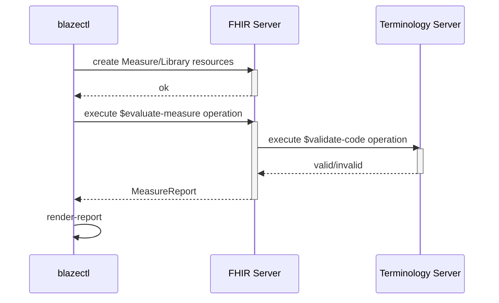

# DQA - CQL

Non-official, non-binding Data Quality Assessments inspired by [DQA](https://github.com/medizininformatik-initiative/DQA).

## Goal

The scripts have the following goals:

* provide a tool to assess the data quality of [MII - KDS][1] resources in a FHIR server
* make use of [FHIR R4 - Quality Reporting Module][2] in combination with [Clinical Quality Language][3]
* make use of [MII SU-TermServ][4] for metadata

## Architecture

The CQL scripts in this repository need the [blazectl][5] CLI tool to drive the DQA process shown in the following sequence diagram. However using blazectl is only a convenience. Everything is available via standard FHIR APIs documented in the [Blaze Docs][6] or [FHIR R4 - Quality Reporting Module][2].  



# Minimal Example Deployment

This repository contains a simple, minimal [Docker Compose file](./docker-compose.yml) that can be used to spin up da Blaze FHIR server and a Blaze terminology server. Other deployments with other CQL enabled FHIR servers and for example [Ontoserver][7] as terminology server are possible.

```sh
docker compose up -d
```

```sh
./download-synthea-test-data.sh
```

```sh
blazectl --server http://localhost:8080/fhir upload <temp-dir>
```

# CQL Script Execution

## Condition

```sh
blazectl --server http://localhost:8080/fhir evaluate-measure scripts/condition.yml | jq -rf scripts/table.jq
```

[1]: <https://simplifier.net/organization/koordinationsstellemii>
[2]: <https://hl7.org/fhir/R4/clinicalreasoning-quality-reporting.html>
[3]: <https://cql.hl7.org>
[4]: <https://mii-termserv.de>
[5]: <https://github.com/samply/blazectl>
[6]: <https://samply.github.io/blaze/cql-queries/api.html>
[7]: <https://ontoserver.csiro.au/>
