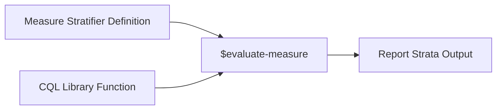
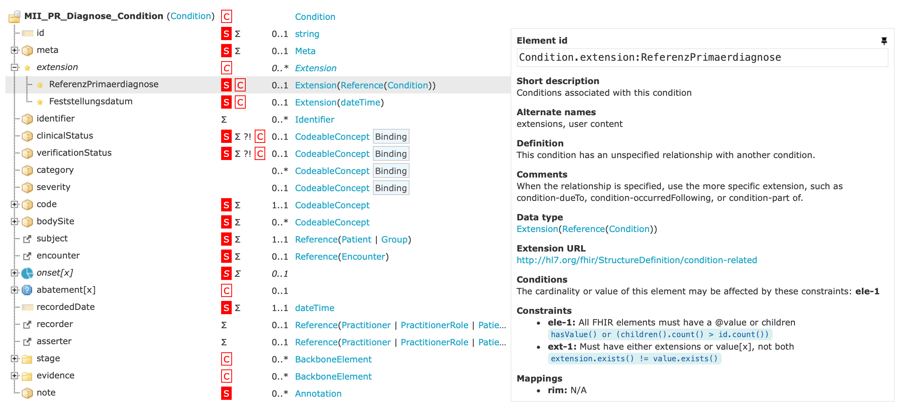
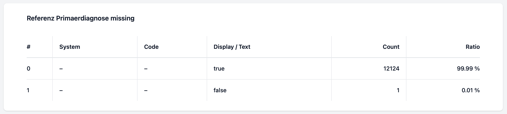
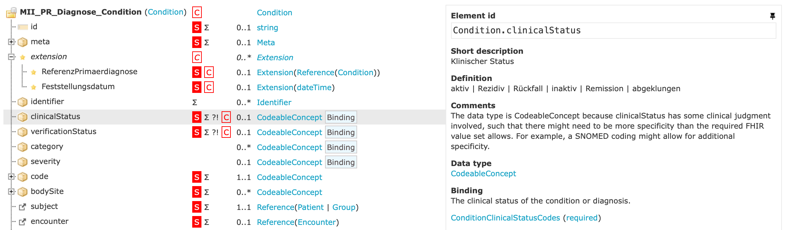
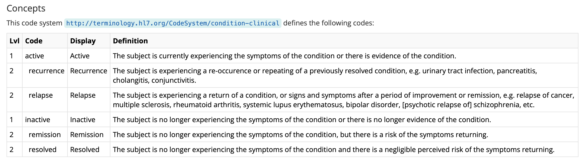
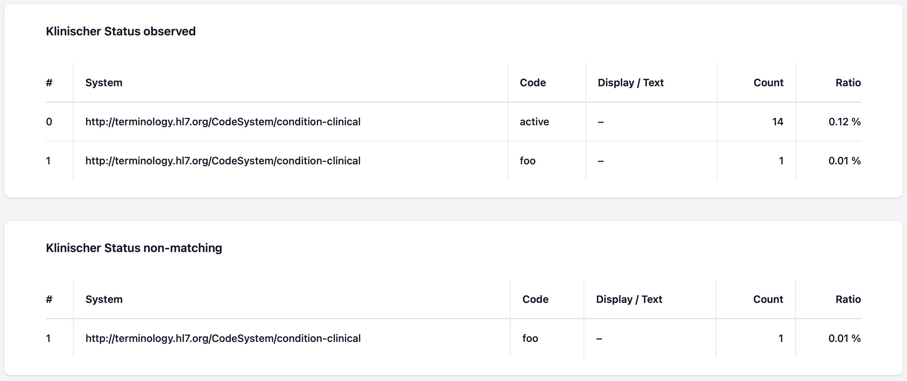
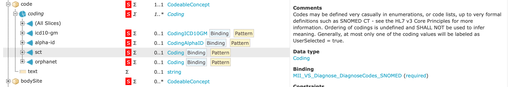
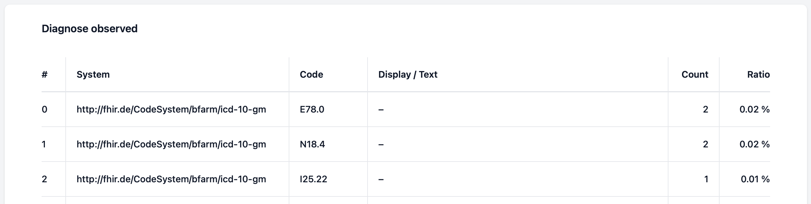
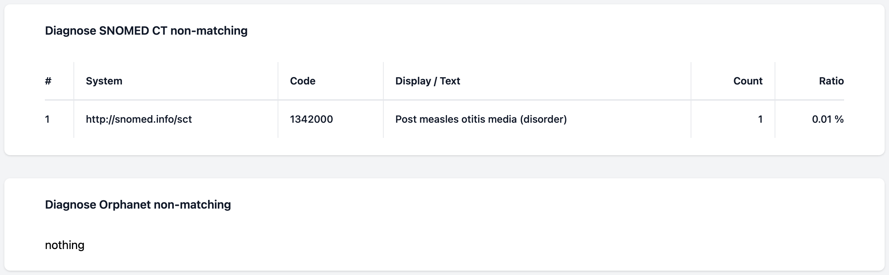

# Script Guide

Basic documentation how to write CQL scripts is available in the [Blaze Docu][1] and in the [CQL Authors Guide][2]. The particular kind of CQL scripts used here are [Quality Reporting][5] scripts. Choose scripts together with a [Measure][6] resource can be used to calculate populations of patients or other types of FHIR resources. In addition that populations can be stratified. Stratifying means to group resources into categories like patients into gender or age classes. Also Condition resources can be grouped by their codes or other values. The strata (stratifier values) together with their absolute counts are output in a [MeasureReport][7] resource.    

A combination of Measure Stratifier Definition and CQL Library Function is used to produce the Report Strata Output.



## Condition Script

The quality assessment scripts are modelled after the FHIR profiles. For example the [condition.cql](../scripts/condition.cql) script is modelled after the [Diagnose][3] profile. From that profile all Must-Support data elements are taken. The first would be `Referenz Primaerdiagnose` which is an extension.

### Referenz Primaerdiagnose

On Simplifier the Diagnose profile looks like this. 



From that the following CQL function was written:

```cql
define function "Referenz Primaerdiagnose missing"(condition Condition):
  not exists condition.extension.where(url = 'http://hl7.org/fhir/StructureDefinition/condition-related').value
```

In that function, the [FHIRPath][4] expression `condition.extension.where(url = 'http://hl7.org/fhir/StructureDefinition/condition-related').value` selects the value of the extension. On top of that expression the operators `exists` and `not` are applied, returning `true` if the value or the whole extension is missing. That "missing" functions are one of the common functions for data elements. They are used on non-categorical data elements.

After defining the function, it has to be registered inside the [condition.yml](../scripts/condition.yml) file as stratifier:

```yml
stratifier:
- code: "Referenz Primaerdiagnose missing"
  expression: "Referenz Primaerdiagnose missing"
```

Using both the CQL function and the Stratifier Definition, the resulting report will contain the following strata:

```json
[
  {
    "value": {
      "text": "true"
    },
    "population": [
      {
        "count": 12124
      }
    ]
  },
  {
    "value": {
      "text": "false"
    },
    "population": [
      {
        "count": 1
      }
    ]
  }
]
```

With the example data available, 12124 references are missing, while one is available. Later with the HTML rendering from `blazectl` the human readable output looks like this:



### Klinischer Status

The next class of data elements consists of categorial variables like Klinischer Status. In the FHIR profile, a ValueSet binding can be seen:



In our case the name of the ValueSet is `ConditionClinicalStatusCodes`. It contains all values of the CodeSystem with the same name. The CodeSystem looks like this in Simplifier:



Having a solid FHIR infrastructure and tooling, we don't need to specify each concept in our CQL script. We have a terminology server which has the ValueSet and CodeSystem available. Please look at the [Minimal Example Deployment](deployment.md) documentation how to import all ValueSet and CodeSystem resources used in the MII.

In the CQL script, we can simply define the ValueSet and give it a name:

```cql
valueset "Klinischer Status": 'http://hl7.org/fhir/ValueSet/condition-clinical'
```

In addition, we will define two CQL functions:

```cql
define function "Klinischer Status observed"(condition Condition):
  condition.clinicalStatus

define function "Klinischer Status non-matching"(condition Condition):
  NonMatching(condition.clinicalStatus, "Klinischer Status")
```

The first function `Klinischer Status observed` will return strata for each observed clinical status while the second function `Klinischer Status non-matching` will return all invalid clinical status concepts. In that the helper function `NonMatching` will do that:

```cql
define function NonMatching(concept CodeableConcept, valueset System.ValueSet):
  if FHIRHelpers.ToConcept(concept) in valueset then
    null
  else
    concept
```

That function will output all concepts that are not in the defined ValueSet. In order to determine the ValueSet membership, the CQL evaluation engine will query the terminology server using the [ValueSet/$validate-code][8] operation. Using our FHIR infrastructure for such ValueSet membership calculations we ensure a single source of truth and have access to large and complex terminologies like SNOMED CT. 

The output will look like this in HTML:



## Diagnose

For the condition code, the profile defines four different slices, one ICD-10-GM, one Alpha-ID, one SNOMED CT and one Orphanet slice. Because each slice has its own ValueSet binding, we have to define multiple `non-matching` functions.



```cql
valueset "Diagnose SNOMED CT": 'https://www.medizininformatik-initiative.de/fhir/core/modul-diagnose/ValueSet/diagnoses-sct'
valueset "Diagnose Orphanet": 'https://www.medizininformatik-initiative.de/fhir/core/modul-diagnose/ValueSet/mii-vs-diagnose-orphanet'

define function "Diagnose observed"(condition Condition):
  condition.code

define function "Diagnose SNOMED CT non-matching"(condition Condition):
  NonMatching(ToCodeableConcept(condition.code.coding.where(system = 'http://snomed.info/sct')), "Diagnose SNOMED CT")

define function "Diagnose Orphanet non-matching"(condition Condition):
  NonMatching(ToCodeableConcept(condition.code.coding.where(system = 'http://www.orpha.net')), "Diagnose Orphanet")
```

The resulting HTML output will look like this:



The observed part is cut off here and will contain all observed concepts. 



The SNOMED CT code `1342000` was cut of intentionally.

[1]: <https://samply.github.io/blaze/cql-queries/blazectl.html>
[2]: <https://cql.hl7.org/02-authorsguide.html>
[3]: <https://simplifier.net/mii-basismodul-diagnose-2024/mii_pr_diagnose_condition>
[4]: <https://hl7.org/fhirpath/N1/>
[5]: <https://www.hl7.org/fhir/R4/clinicalreasoning-quality-reporting.html>
[6]: <https://www.hl7.org/fhir/R4/measure.html>
[7]: <https://www.hl7.org/fhir/R4/measurereport.html>
[8]: <https://www.hl7.org/fhir/R4/valueset-operation-validate-code.html>
